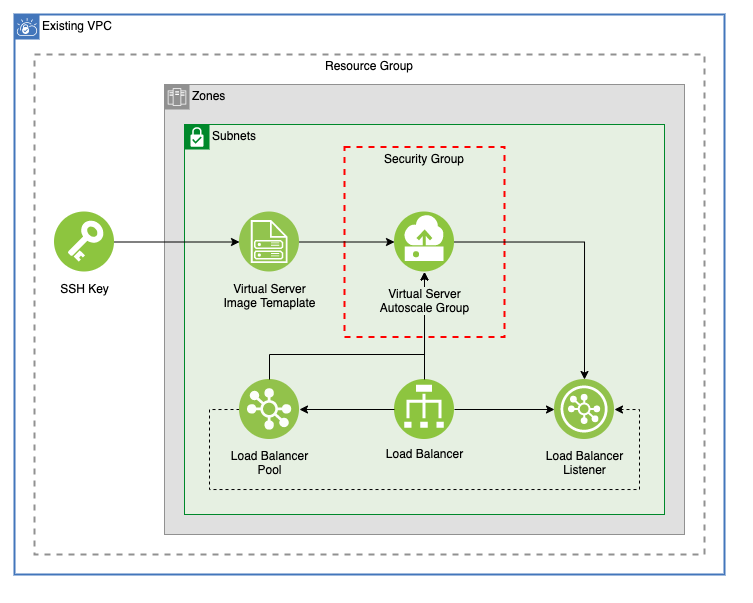

# VSI Autoscale Group

This template creates a VSI autoscale group across any number of subnets. This autoscale group is connected by a VPC Load Balancer.

## Table of Contents

1. [Prerequisites](##Prerequisites)
2. [Network](##network)
3. [Load Balancer](##load-balancer)
4. [SSH Key](##ssh-key)
5. [Instance Template](##instance-template)
6. [Instance Group](##Instance-Group)
7. [Module Variables](##Module-Variables)

---

## Prerequisites

This template requires an existing VPC with at least one subnet attached. This example installs NGINX on the VSI and requires the virtual servers in the autoscale group to be able to recieve inbound traffic and send outbound traffic.

To read more about autoscaling on VPC, read the docs [here](https://cloud.ibm.com/docs/vpc?topic=vpc-creating-auto-scale-instance-group&locale=en).

---

## Network

An example security group with two rules is created for the autoscale group. For this example, it creates rules to allow both all inbound and all outbound traffic from the servers in the autoscale group

---

## Load Balancer

The Virtual Servers in the autoscale group are connected via a VPC Load Balancer. This load balancer is created across all of the subnets where the autoscale group will be created. A back end pool is also created. Once the autoscale group has finished provisioning, a listener will be added to expose the example NGINX application.

---

## SSH Key

This module creates an ssh key for VPC using the `ssh_public_key` variable. To use an existing SSH Key, change this block and it's references to a `data` block.

---

## Instance Template

To create an autoscaling group, a template for the virtual servers is created. This module attaches it to the first subnet in the list of `subnet_ids` variable. The template is screated with the SSH Public Key. That key will be used by all of the machines in the autoscale group.

---

## Instance Group

An autoscale instance group is created based on the instance template. To enable autoscaling, an instance group manager is created. Instance Group Policies are also created to allow for dynamic scaling of the virtual servers

---

## Module Variables

### Account Variables

Variable Name            | Type   | Description                                                                                                 | Default
-------------------------|--------|-------------------------------------------------------------------------------------------------------------|---------------------------------------------------------
`ibmcloud_api_key`       | string | The IBM Cloud platform API key needed to deploy IAM enabled resources                                       |
`ibm_region`             | string | IBM Cloud region where all resources will be deployed                                                       |
`resource_group`         | string | Name of resource group to create VPC                                                                        | `asset-development`
`unique_id`              | string | The IBM Cloud platform API key needed to deploy IAM enabled resources                                       | `asset-module-vsi`

### VPC Variables

Variable Name            | Type   | Description                                                                                                 | Default
-------------------------|--------|-------------------------------------------------------------------------------------------------------------|---------------------------------------------------------
`vpc_name`               | string | Name of VPC                                                                                                 |
`subnet_ids`             | list   | A list of subnet ids where the VSI will be deployed                                                         |

## Virtual Server Variables

Variable Name            | Type   | Description                                                                                                 | Default
-------------------------|--------|-------------------------------------------------------------------------------------------------------------|---------------------------------------------------------
`image`                  | string | Image name used for VSI. Run 'ibmcloud is images' to find available images in a region                      | `ibm-centos-7-6-minimal-amd64-2`
`ssh_public_key`         | string | ssh public key to use for vsi                                                                               |
`machine_type`           | string | VSI machine type. Run 'ibmcloud is instance-profiles' to get a list of regional profiles                    | `bx2-8x32`
`application_port`       | string | The port number of the application running in the server member.                                            | `80`

### Instace Group Manager Variables

Variable Name            | Type   | Description                                                                                                 | Default
-------------------------|--------|-------------------------------------------------------------------------------------------------------------|---------------------------------------------------------
`enable_manager`         | bool   | Enable or disable the instance group manager. Default value is true                                         | `true`
`min_instances`          | number | Minimum of VSI instances for autoscaling group                                                              | `3`
`max_instances`          | number | Maximum number of instances in autoscaling group                                                            | `9`
`aggregation_window`     | number | The time window in seconds to aggregate metrics prior to evaluation.                                        | `120`
`cooldown`               | number | The duration of time in seconds to pause further scale actions after scaling has taken place.               | `300`
`manager_type`           | string | The type of instance group manager. Default value is autoscale.                                             | `autoscale`
`group_manager_policies` | list   | A list of policies for your instance group manager                                                          | `[{ metric_type  = "cpu" }`  `{ metric_value = 70 }]`

### Load Balancer Variables

Variable Name            | Type   | Description                                                                                                 | Default
-------------------------|--------|-------------------------------------------------------------------------------------------------------------|---------------------------------------------------------
`lb_type`                | string | Load Balancer type, can be public or private                                                                | `public`
`algorithm`              | string | The load balancing algorithm. Supported values are round_robin, weighted_round_robin, and least_connections | `round_robin`
`protocol`               | string | The pool protocol. Supported values are http, and tcp.                                                      | `http`
`health_delay`           | String | The health check interval in seconds. Interval must be greater than timeout value.                          | `10`
`health_retries`         | string | The health check max retries.                                                                               | `10`
`health_timeout`         | string | The health check timeout in seconds.                                                                        | `5`
`health_type`            | string | The pool protocol. Supported values are http, and tcp.                                                      | `http`
`listener_protocol`      | string | The listener protocol. Supported values are http, tcp, and https                                            | `http`
`certificate_instance`   | string | Optional, the CRN of a certificate instance to use with the load balancer.                                  | `""`
`connection_limit`       | number | Optional, connection limit for the listener. Valid range 1 to 15000.                                        | `0`
